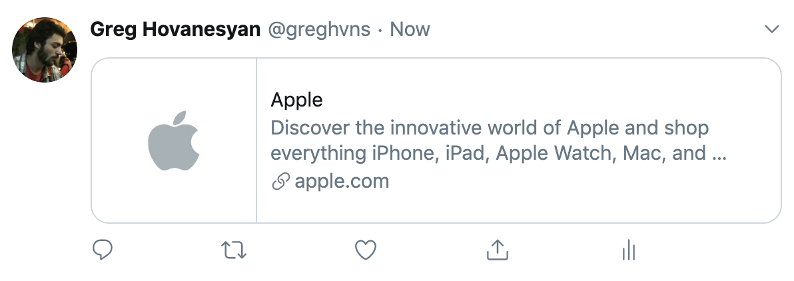
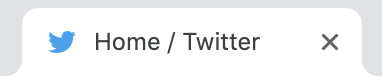

# Website Launch Checklist
Things to double-check before launching a website

Before launching the website ensure that:


## All images have "Alt" tags
An alt tag ("alt attribute" or "alt description") is an attribute applied to an image which serves as an invisible description of the image. 

It describes the contents of an image and used by screen readers to read aloud to blind users.
It is also used by search engines since they cannot interpret images, they rely on the alt tag description. Using alt tags on images positively impacts search engine ranking, thus it is good for SEO.
Alt text is also displayed when the images fail to load.

Alt tag has to describe the image contents and it is recommended to be up to 125 characters long.

Example:
```html

```

## Website is allowed for indexing

If you have a "staging" or "dev" environment then chances are you are blocking staging from indexing. 

If you want your website to appear in search results, that search engine shall "index" your website. Search engines have automated "bots" that visit webpages, "crawl" the content and store it the search engine's index. That will allow the search engine to later retrieve most relevant search results.

Before launching make sure that the version that will go live allows indexing of your website. Ensure you have no such meta tag in your HTML:

```html
<meta name="robots" content="noindex, nofollow"> <!-- make sure you remove this if you want your website to be indexed by search engines
```

Also, check your robots.txt file. If you want to *allow* all pages of your website to be indexed, then your robots.txt shall contain this:

```
User-agent: *
Disallow:
```

One more place to check is Apache/Nginx configurations.

## Social Media meta tags are present

When a website is shared to Facebook or Twitter it displays a thumbnail, a title, and a description:



If you want your website to be displayed with a correct thumbnail, title and description you have to add meta tags required by Facebook and Twitter.

```html
<meta property="og:title" content="Title">
<meta property="og:description" content="Description">
<meta property="og:image" content="Image URL">
<meta property="og:url" content="URL of the page/article/post">

<meta name="twitter:title" content="Title">
<meta name="twitter:description" content="Description">
<meta name="twitter:image" content="Image URL">
<meta name="twitter:card" content="summary_large_image"> <!-- how the card is displayed -->
```

You can test how your website will look when shared to Facebook or Twitter using these tools:

[Facebook Sharing Debugger](https://developers.facebook.com/tools/debug/sharing/)

[Twitter Card Validator](https://cards-dev.twitter.com/validator)

## Favicon is present

Favicon is the small icon near the website title in the browser tab.



It makes the website easy to identify when many tabs are open, viewing browser history and bookmarks. Some search engines, such as DuckDuckGo displays the favicon near the URL in the search result. Apart from improving the usability, it can help catch user's attention in the search results, so we can call it an indirect SEO technique.

```html
<link rel="shortcut icon" type="image/png" href="/favicon.png">
```

## Progressive Web App meta tags are present

Users can save a webpage to their home screen on mobile devices. That creates an icon for the website, just like the app icon, tapping that icon will open the website in the browser.

Developers are given some control to make the website experience closer to a native app experience on mobile. For example, by default, iOS will set the screenshot of the website as an icon. But you can set a custom icon design using the Apple meta tags.

```html
<link rel="apple-touch-icon" href="touch-icon-iphone.png">
<link rel="apple-touch-icon" sizes="152x152" href="touch-icon-ipad.png">
<link rel="apple-touch-icon" sizes="180x180" href="touch-icon-iphone-retina.png">
<link rel="apple-touch-icon" sizes="167x167" href="touch-icon-ipad-retina.png">
<link rel="apple-touch-startup-image" href="launch.png"> <!-- Splash screen image (image that is displayed when the website is buing opened) -->
<meta name="apple-mobile-web-app-status-bar-style" content="default"> <!-- Status bar style -->
<meta name="apple-mobile-web-app-title" content="My Website"> <!-- title of the website --> 
```

Android will use the "apple-touch-icon" value or the favicon (if the meta tag is not present) to create a home screen icon.

## Analytics tracking only in the production environment

If the analytics tool you use does not have a filter for the environment, then you will be polluting the analytics of your website with results from testing in a non-production environment. You can add the filter in the analytics tool or conditionally embed the code only on the production environment.

## Password pasting is not disabled

Some claim the disabling password paste increases website security. National Cyber Security Centre claims that it is invalid. According to Google, allowing users paste the password improves security, because it enables them to use password managers.

## Document has title and meta description

Title tag specifies the title of the website. The meta description tag contains a short description of the page

```html
<title>Page Title</title>
<meta name="description" content="A short description of what this page is about">
```

Title is what displayed in the search engine results, displayed in the browser tab and in the social network cards when sharing (if a separate title is not provided for the social network). 

Description is displayed in the search results as well. It is not directly used in the ranking algorithm, so it doesn't affect chances of appearing in the search result, but it makes it more likely that users will click on you website in the results. That will increase the click-through-rate (CTR) of your page for Google, that means that Google will consider it a good result and will rank higher in future search results.

## External links have rel="noopener"

If you have links to external links on your webpage, especially the ones that open in a new tab or window, you should use `rel="noopener"`.

```html
<a href="http://example.com" target="_blank" rel="noopener">Some other site</a>
```

There are security and performance benefits in doing so. Without it the external page can access your window object using `window.opener`. You can learn more about what vulnerabilities are solved by using the `noopener` here: [About rel=noopener](https://mathiasbynens.github.io/rel-noopener/)

The other website may also run on the same process as your current page, so it the external page is running some heavy JavaScript it will negatively affect your website performance. `noopener` prevents that as well. 

Read more about it here: [The performance benefits of rel=noopener](https://jakearchibald.com/2016/performance-benefits-of-rel-noopener/)

